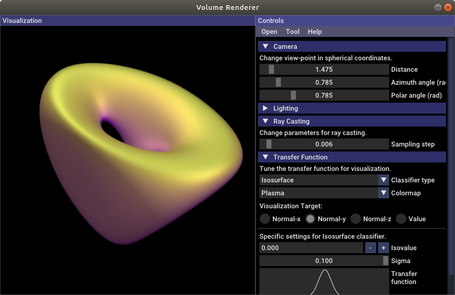

# Volume Renderer

An interactive volume visualization tool using CUDA for real-time rendering.

Tested on Ubuntu 18.04 LTS with CUDA 11.2 and OpenGL 3.2.

For implementation details and more results, please check the slides and videos [here](https://drive.google.com/drive/folders/1H4_vyyNHNk-NSeIf7cve_XxySz47Aheg?usp=sharing).


## Key Features

- Entire volume rendering
- Isosurface rendering with volumetric techniques
- Phong lighting for enhancing structral details
- Tri-linear interpolation of volume data
- UI for tuning visualization settings


## Usage

Type the command below to compile and run the program.

```bash
# Compilation
cmake ..
make

# Run the excutable
./volrend
```

You may need to tune some configurations like device ID, threading block size, etc., which are specified in the 'include/config.hpp'.


## Demo





## Third-party Libraries

- Dear ImGui (included in 3rdLibs/)
- tinycolormap (re-implemented in CUDA)
- Eigen (included in 3rdLibs/)
- GLAD (included in 3rdLibs/)
- GLFW 3.2+
- stb_image (included in 3rdLibs/)

## License

[The GNU General Public License v3.0](https://www.gnu.org/licenses/gpl-3.0.en.html)

